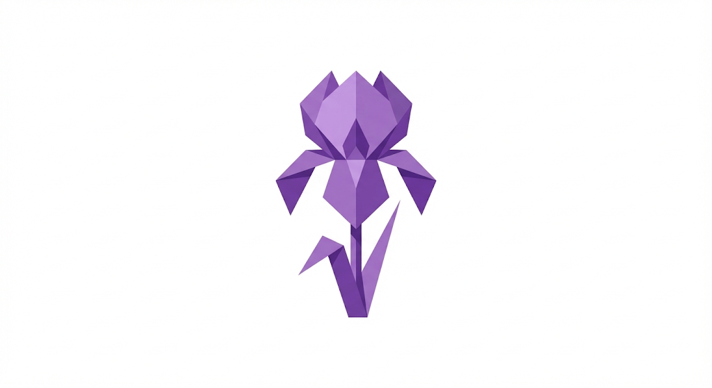
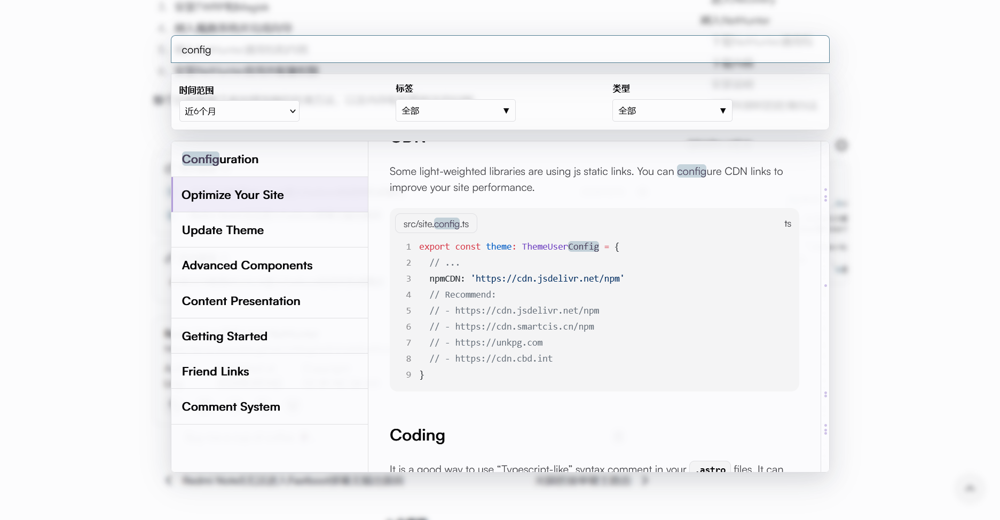
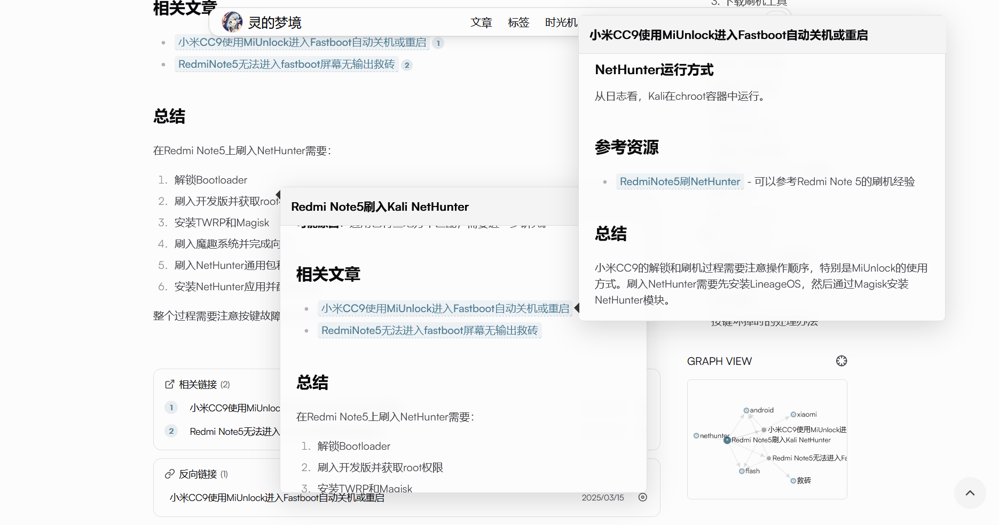

# Astro Theme Iris

[English](./README.md) | 简体中文

<div align="center">
  
</div>

---

## 📸 展示图

**示例博客**: [https://lemonadorable.github.io/](https://lemonadorable.github.io/)

> [!NOTE]
> 已知问题：Head 标签和自定义选项仍在开发中（已暴露模板用于修改）

<div align="center">
  
  <p><em>首页全屏展示与动画效果</em></p>
</div>

<div align="center">
  
  <p><em>强大的搜索预览系统 - 支持分类筛选、实时预览、滚动标记</em></p>
</div>

<div align="center">
  
  <p><em>双链预览、Graph View 与知识图谱</em></p>
</div>

---

## 🎨 Iris 紫鸢模板说明

本项目基于 [astro-theme-pure](https://github.com/cworld1/astro-theme-pure) 进行了定制，旨在将**博客**、**简介**与**知识库**结合，打造一个功能强大的个人知识管理系统。

### ✨ 核心特性

#### 🔍 强大的搜索系统

- **FlexSearch 全文搜索**：支持中文、英文等多种语言的高性能搜索
- **三栏预览布局**：搜索结果、内容预览、滚动标记一体化
- **多维度筛选**：支持按时间范围、标签、类型（文章/文档）筛选
- **实时高亮**：搜索结果实时高亮，支持滚动定位

#### 🔗 双链系统（Wikilinks）

- **多级预览**：使用 Tippy.js 实现类似 Quartz 的多层预览功能
- **智能定位**：支持反向链接与反向定位引用
- **流畅交互**：支持嵌套预览

#### 🗺️ 知识图谱（Graph View）

- **D3.js 有向图**：可视化页面之间的关联关系
- **本地/全局视图**：支持查看当前页面的局部图谱或全站全局图谱
- **节点类型**：区分文章、文档、标签、目录等不同类型
- **交互式操作**：支持拖拽、缩放、点击跳转

#### 🎨 界面优化

- **全屏主页**：沉浸式首页设计，支持动画效果
- **渐变背景**：文章卡片采用淡紫色渐变背景
- **交互动画**：头像与友链的交互动画效果
- **响应式设计**：适配桌面端和移动端

#### 💬 评论系统

- **Giscus 集成**：基于 GitHub Discussions 的评论系统

#### 📊 Mermaid Integration

- **Mermaid Integration**: Mermaid integration for diagramming

#### 🖋️ Typst 排版系统

- **Typst 支持**：支持在 MDX 中原生渲染高质量的数学公式、矢量图表与学术排版

### 🚀 快速开始

#### 选项 1: 作为模板使用 (推荐)

1. 点击本仓库顶部的 **"Use this template"** 按钮。
2. 将新仓库克隆到本地。
3. 安装依赖并开始开发：
   ```shell
   bun install # 或 npm install
   bun dev     # 或 npm run dev
   ```

#### 选项 2: 手动安装

```shell
# 克隆仓库
git clone https://github.com/LemonAdorable/astro-theme-iris.git
cd astro-theme-iris

# 安装依赖
bun install # 或 npm install
```

### 🔄 更新主题

要获取 Iris 主题的最新功能和修复：

```shell
# 添加上游仓库 (只需执行一次)
git remote add upstream https://github.com/LemonAdorable/astro-theme-iris.git

# 获取并合并 main 分支的更新
git fetch upstream main
git merge upstream/main --allow-unrelated-histories
```
> [!TIP]
> `--allow-unrelated-histories` 参数仅在第一次合并（当历史记录不相关时）需要。后续更新只需执行普通的 `git pull upstream main` 即可。

### 📝 待办事项

- [ ] 英文或多语言支持
- [ ] 首页简历功能
- [ ] 打包主题以及新增的各种组件
- [ ] 更多文档和示例

### 📚 仓库结构

```
Iris 主题 (LemonAdorable/astro-theme-iris)
  └── main 分支 (上游)
      ↓ (fetch & merge)
你的博客仓库
  └── main 分支 (你的内容 + Iris 组件)
```

### 🙏 致谢

本项目基于以下优秀的开源项目：

- **[astro-theme-pure](https://github.com/cworld1/astro-theme-pure)** - 基础主题框架
- **[FlexSearch](https://github.com/nextapps-de/flexsearch)** - 高性能全文搜索引擎
- **[Tippy.js](https://atomiks.github.io/tippyjs/)** - 强大的工具提示库
- **[D3.js](https://d3js.org/)** - 数据可视化库
- **[Quartz](https://quartz.jzhao.xyz/)** - 知识库主题设计理念参考
- **[Obsidian](https://obsidian.md/)** - 双链笔记理念参考

### 📞 联系方式

如有问题或建议，欢迎发邮件联系

### 📋 使用说明

#### 搜索功能

- 按 `Ctrl+K` 或 `Cmd+K` 打开搜索框
- 支持中文、英文全文搜索
- 可通过时间范围、标签、类型进行筛选
- 点击搜索结果可跳转到对应页面
- 右侧预览区域支持滚动标记定位

#### 双链预览

- 在文章中使用 `[[链接文本]]` 或 `[[链接|显示文本]]` 创建双链
- 鼠标悬停在双链上可预览链接内容
- 支持多层嵌套预览
- 预览框支持交互，可点击链接跳转

#### 知识图谱

- 文章和文档页面侧边栏显示 Graph View
- 点击节点可跳转到对应页面
- 支持拖拽节点调整布局
- 点击右上角按钮可查看全站全局图谱

### ⚙️ 配置说明

主要配置文件位于 `src/site.config.ts`，可以配置：

- 站点基本信息（标题、描述、作者等）
- 社交链接
- 评论系统（Giscus/Waline）
- 其他主题选项

### 📄 许可证

本项目基于 [Apache 2.0 许可证](https://github.com/LemonAdorable/astro-theme-iris/main/LICENSE) 开源。

### ⭐ Star History

[](https://star-history.com/#LemonAdorable/astro-theme-iris&Date)
