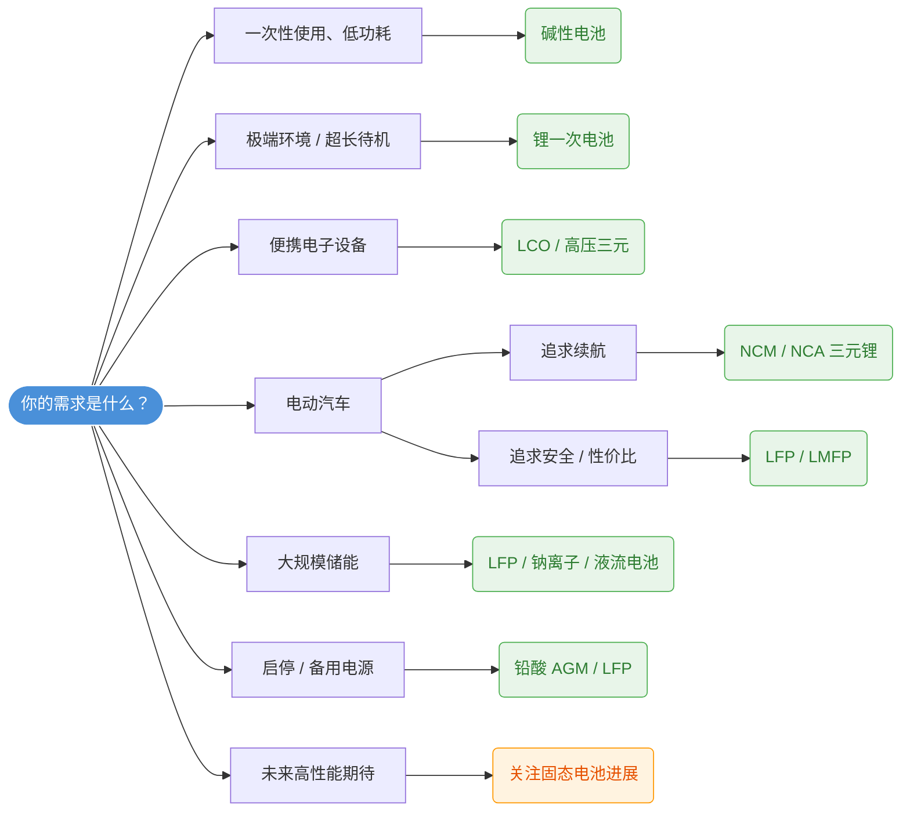

## 电池类型全解析：从日常消费到前沿科技，一文读懂所有电池

> **导读**：电池是现代文明的“移动能量心脏”。从手中的智能手机到路上的电动汽车，再到电网级的储能电站，不同场景对电池的性能、成本和安全性有着截然不同的要求。本文由猫角域整理，将系统梳理当前主流及前沿的电池类型，帮助你建立完整的电池知识体系。

---

## 一次电池（不可充电）

一次电池即我们常说的“干电池”，放电后无法通过充电恢复活性物质，适合低功耗、间歇性使用的设备。

### 碱性电池 (Alkaline)
-   **化学体系**：锌-二氧化锰 (Zn-MnO₂)
-   **特点**：能量密度适中、自放电率低、价格低廉、无记忆效应。
-   **应用**：遥控器、钟表、玩具、手电筒等 household 设备。
-   **注意**：长期不使用应从设备中取出，防止漏液腐蚀电路。

### 锂-亚硫酰氯电池 (Li-SOCl₂) / 锂-二氧化锰电池 (Li-MnO₂)
-   **化学体系**：锂金属负极 + 有机电解液
-   **特点**：**超高能量密度**、极宽工作温度范围（-40℃~+85℃）、超长储存寿命（10年以上）。
-   **应用**：智能电表、胎压监测(TPMS)、军事/航天设备、医疗植入物。
-   **注意**：属于危险品，不可充电，短路可能引发热失控。

### 锌碳电池 (Zinc-Carbon)
-   **特点**：最古老的一次电池，成本极低但容量小、大电流性能差。
-   **现状**：正逐步被碱性电池取代，仅存于极低端市场。

---

## 二次电池（就是可充电）—— 消费电子与动力电池主力

### 锂离子电池 (Lithium-Ion, Li-ion) 

当前绝对主流啊，小到耳机、大到巨轮，都在用这玩意儿！

不过，锂离子电池有点多，总的来说就是一个庞大的家族，一般根据正极材料来分，不同征集性能差异巨大：

| 子类型               | 正极材料                          | 核心优势                           | 主要短板           | 典型应用                |
| :---------------- | :---------------------------- | :----------------------------- | :------------- | :------------------ |
| **钴酸锂 (LCO)**     | LiCoO₂                        | 体积能量密度最高                       | 成本高、热稳定性差      | 手机、笔记本、TWS耳机        |
| **磷酸铁锂 (LFP)**    | LiFePO₄                       | **安全性极佳**、循环寿命长(3000+)、成本低     | 能量密度偏低、低温性能弱   | 电动汽车(标准续航)、储能电站、两轮车 |
| **三元锂 (NCM/NCA)** | LiNiₓCoᵧMn₂O₂ / LiNiₓCoᵧAl₂O₂ | 高能量密度、低温性能好                    | 热稳定性不如LFP、含贵金属 | 电动汽车(长续航)、高端电动工具    |
| **锰酸锂 (LMO)**     | LiMn₂O₄                       | 倍率性能好、成本低                      | 循环寿命短、高温衰减快    | 电动工具、混动汽车(HEV)      |
| **钛酸锂 (LTO)**     | Li₄Ti₅O₁₂(负极)                 | **超快充**(6C+)、超长寿命(10000+)、极致安全 | 能量密度很低、成本高     | 公交车、电网调频、特种车辆       |

> **趋势**：这几年碳酸锂的价格来了个过山车，市场也从追面密度变成追安全，随着铁锂快充推进到10C水平，充电时间缩短到10分钟以内，并且凭借成本和安全优势，在全球动力电池市场的装机占比已超越三元锂；同时"磷酸锰铁锂(LMFP)"作为LFP的升级版正在加速量产，能量密度提升15-20%。个人认为业界后续10年内铁锂依旧是主流，部分高端产品使用三元（大概率使用固态）。

### 镍氢电池 (NiMH)
-   **特点**：比镍镉环保、能量密度中等、技术成熟、耐过充过放。
-   **应用**：丰田普锐斯等HEV混动车型、充电AA/AAA电池、部分消费电子。
-   **现状**：在纯电领域已被锂电取代，但在HEV和民用充电电池领域仍有稳固地位。

### 铅酸电池 (Lead-Acid)
-   **特点**：**成本最低**、技术最成熟、回收体系完善；但重量大、能量密度低、含铅污染风险。
-   **应用**：汽车启动电池(12V)、电动自行车(低端)、UPS不间断电源、通信基站备电。
-   **演进**：AGM/EFB启停电池、胶体电池等改进型仍在广泛使用。

---

## 新型/下一代电池技术

这些技术大多处于实验室到中试/早期量产阶段，被视为未来5-10年的变革力量。

### 固态电池 (Solid-State Battery)
-   **核心创新**：用固态电解质替代液态电解液
-   **预期优势**：能量密度可达400-500 Wh/kg、本质安全(不燃不爆)、支持更高电压正极
-   **挑战**：固-固界面阻抗大、制造工艺不成熟、成本极高
-   **进展**：半固态电池已在部分车型装车；全固态电池预计2027-2030年实现规模化量产。

### 钠离子电池 (Sodium-Ion)
-   **核心创新**：用 abundant 的钠替代稀缺的锂
-   **优势**：原材料丰富且便宜、低温性能优于LFP、可用铝箔做负极集流体(进一步降本)
-   **劣势**：能量密度低于锂电(120-160 Wh/kg)
-   **定位**：**锂电池的低成本补充**，主攻两轮车、A00级电动车、大规模储能。2024年起已进入商业化元年。

### 锂硫电池 (Li-S) & 锂空气电池 (Li-Air)
-   **理论能量密度**：远超现有锂电(Li-S理论2600 Wh/kg)
-   **瓶颈**：穿梭效应、循环寿命极短、空气电极催化难题
-   **状态**：仍处于基础研究阶段，距离商用尚远。

### 液流电池 (Flow Battery)
-   **代表体系**：全钒液流(VRB)、铁铬液流
-   **特点**：功率与容量解耦、循环寿命极长(10000+)、本质安全、适合GWh级长时储能
-   **局限**：能量密度低、系统复杂、初始投资高
-   **应用**：电网级4小时以上长时储能。

---

## 如何选择合适的电池？决策框架

---

## 电池怎么避免爆炸！

一般来说电池不会爆炸，不过还是注意正常使用规范，我整理了一下大部分电池使用的通用规则：

1.  **避免极端温度**：高温加速老化，低温导致析锂（永久损伤）。这个高温在铁锂上一般指的是内部超过60℃，低温就是零下，尽量避免充电，铁锂最好的使用温度范围是25-35℃。
2.  **浅充浅放延寿**：锂电池保持在20%-80% SOC区间循环寿命最长。
3.  **使用原装充电器**：劣质充电器缺乏BMS保护，是起火主因之一。
4.  **鼓包立即停用**：电池鼓包意味着内部产气，存在热失控风险。
5.  **规范回收**：废旧电池含有害物质，请投放至专用回收点，切勿随意丢弃。

---

## 结语

电池技术正处于百年未有之大变局。**磷酸铁锂的复兴、钠离子的崛起、固态电池的攻坚**三条主线并行推进，没有一种电池能"通吃"所有场景。理解各类电池的特性与边界，才能在产品设计、购车选择乃至投资决策中做出明智判断。

> **免责声明**：本文内容由猫角域基于公开资料整理，仅供科普参考。具体产品选型请以厂商技术规格书为准。电池技术发展迅速，建议持续关注最新行业动态。

---

*如果这篇博客对你有帮助，欢迎收藏转发！有任何问题或补充，请邮件联系[猫角域](mailto:42@maojiaoyu.com)或在评论区留言讨论。* 